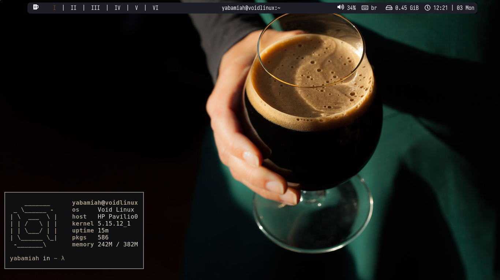

# schwarzbier dotfiles
Linux config with a black beer themed BSPWM.

git clone https://github.com/yabamiah/schwarzbier-dotfiles.git

### pfetch

## What you will find here
| Progam | Name |
| :--- | :--- |
| Linux Distribution | [Void Linux](https://voidlinux.org/) |
| Window Manager | [BSPWM](https://github.com/baskerville/bspwm) |
| Bar | [polybar](https://github.com/jaagr/polybar) |
| Program Launcher | [rofi](https://github.com/DaveDavenport/rofi) |
| GTK theme | [Qogir](https://github.com/vinceliuice/Qogir-theme) |
| Icon theme | [Papirus](https://github.com/PapirusDevelopmentTeam/papirus-icon-theme) |
| Shell | [zsh](https://www.zsh.org/) |
| Terminal Emulator | [Kitty](https://github.com/kovidgoyal/kitty) |
| Main Code Editor | [nvim](https://github.com/neovim/neovim) |

**Into the Void...**
